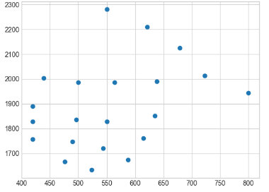
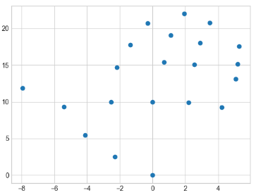

# Jester Development Blog 

This blog is to document the research and design done during the development of Jester. 

_____

## System Front End - Paul - 7/04/2021
By week 8 I had to stop working on the classifier as there was still no progress made on the system's front end.

### Why Web Tech?

A webpage seemed like a good choice for the system's front end for a number of reasons:
1.  I have experience with HTML, JavaScript, and CSS.
2.  Web technologies have excellent documentation via the MDN.
3.  I was under time pressure and JS is an easy language to develop fast prototypes with.
4.  The webpage would not be limited to any single platform.

### HTML/JavaScript Prototype
Before investing too much time into an upfront design I wanted to ensure that all the requirements of the system could be implemented using HTML and JavaScript. I began researching the getUserMedia() method in JS and seeing if I could hack something together that works.

I made a simple prototype that had all the necessary features and could be tested through the use of buttons (relying only on gestures was clunky when it came to testing the prototype). The prototype was able to display the camera preview, take pictures, start and stop video recording, and send images across the network to be classified via HTTP POST requests.

One issue I faced was stopping the video using gestures. Recording a video stream and sending a preview snapshot to the classifier would require concurrency, which isn't possible in JavaScript. I was able to overcome this by using a setTimeout() to pause the video recording in set intervals, then take and send a preview snapshot, and then stop or resume the video recording based on the classification of that snapshot. If the snapshot was a stop gesture, the video stopped, otherwise the recording resumed.

### Vue.js Implementation
Once I confirmed that HTML and JavaScript could be used to build the system I began making a more detailed design of the front end. I decided to go with Vue.js as a frontend framework, which would make sharing media across the app's components easier. Vue.js also allows components to be shown on a single dynamically rendered webpage, which allows for a better user experience.

To design the user interface I began sketching wireframes, then developing mock-ups in Figma. I created several iterations of the mock-ups before creating the app itself.

### How it works 
The app displays a camera preview in a <video> tag. This preview allows the user to see themselves in the frame of the camera. Snapshots of the preview are taken at a set intervals and posted to the server, which returns a classification. Depending on the classification a specific camera instruction will be carried out. Photos and videos taken are displayed in the app's gallery component where they can be downloaded.

## Git Hooks and Automated Testing - Paul - 24/03/2021
Git hooks are a way to run useful scripts before git events such as commiting or merging occur. I created some to help with our project workflow. 

I made scripts to warn the user if they are about to commit to the master branch, and to validate that the commit message typed has at least 5 words in it (good commit messages are important!).

### Automated Testing
I also created a script which automatically runs all pytest tests in the repository. Pytest automatically detects files named with the *_test.py convention so this was very doable. I found that these tests locally before commits is more suiitable than on GitLab since the most important tests depend on OpenPose being installed on the machine. 

### Sharing Hooks 
The scripts used are in a folder called git hooks in the root of the repo so we can both use them on our machines. 

## Server and API - Paul - 1/03/2021
An API is needed to connect the mobile devices running the Jester app to the server where images are processed. Images are sent from devices to the server, and a classification is returned.

###  Flask Server/API
I implemented a REST API using the Python Flask micro web-framework. The API accepts two types of calls: a GET request to test the connection, and a POST request to send an image to the server and return a classification. When an image is POSTed, its filetype is verified and it's then processed by the classifier. 

In order for multiple instances of the app to have images classified at the same time, each image needs to have a unique file name. This requirement will need to be implemented in the mobile app. 

### Testing
I used the python requests and pytest libraries to make a test program called server_tests.py which sends files across the network and asserts that the API behaviour is correct. The tests can be run from a different computer that is on the same network (local network in this case) as the server. I also accessed the "test_connection" URL from a mobile browser on the same network to ensure it was working. 

## Classifier and Anomoly Detection - Paul - 22/02/2021

###  Server-side Pipeline
The server side of Jester consists of a pipeline that reads in an image and returns a classification. The processes in this pipeline are called from the program get_class.py. 

###  Classifier
Initially the pipeline used the k-nearest neighbours (KNN) algorithm from the SciKit-Learn library. This was useful to create tests to measure the accuracy of the classifier. I then implemented KNN from scratch. 

KNN was implemented as a class which takes the parameter k. The get_knn function takes in a list of gesture coordinates and returns a list of the k nearest neighbours to those coordinates in the dataset. The distance between neighbours is measured using the euclidean distance. The predict function then finds the most frequent class in the list of nearest neighbours. 

### Anomoly Detection
In order to detect out of distribution (OOD) hand gestures we needed an anomoly detection algorithm. The simplest way to look for outliers using the KNN algorithm is by looking at the distance of the kth nearest neighbour, or the average distance of the k nearest neighbours [1]. These algorithms were unable to pass tests I created to detect OOD gestures. 

The study where I found the Kthnn and Knn outlier detection algorithms also suggested the LoF algorithm, which compares the density of an object's neighbourhood to the density of each of its neighbour's neighbourhood. The LoF algorithm can be slow as it must calculate lists of nearest neighbours k 2  + 1 times, which leads to an enormous number of distance calculations. The local distance outlier factor (LdoF) is a recent algorithm that can be as accurate as LoF while requiring far fewer calculations and being much simplier to implement [2].

My implementation of the LdoF algorithm was only 90% accurate (according to my tests) at classifying KNN results as being in or out of distribution.

I developed the LoF algorithm from scratch to see if it could be more accurate, and after some debugging it was able to pass **all** the tests. The implementation of this algorithm is the aspect of the project that I'm most proud of so far.

### Testing
I created a set of 10 tests in get_class_tests.py which put images through the pipeline to be classified. The images include recognised hand gestures, OOD hand gestures, and images without hands at all. These tests were useful for measuring the accuracy of the KNN algorithm and various anomoly detection algorithms. The combination of KNN and LoF allowed all tests to be passed. 

I also made some simple unit tests to ensure that the functions in the KNN, KthNN, Ldof, and LoF algorithms were correct. 

### Profiling and Performance
The file classifier_profiling.py measures the performance of the KNN and anomoly detection algorithms. This program allowed me to identify bottlenecks in the system and measure improvements. 

I fed dummy data into the alorithms and recorded the execution time of each algorithm. The program runs each function 5 times and prints the average execution times. 

I found that by reading in the csv file once as part of the constructor of the KNN class, I could improve the speed of all the algorithms as they depended on that class. Using a Pandas DataFrame structure rather than rereading a CSV file also increased performance. I found that using a single KNN class instance was faster than creating an instance many times in the LoF algorithm. 

These changes improved execution times as followed :

|Algorithm (k=5 for all)   | Before Optimisations (seconds) |  After Optimisations (seconds) |
|:-------------------------:|:-------------------------:|:-------------------------:|
|KNN  |  0.078| 0.071 |
|LdoF  |  0.000|0.000 |
|LoF  |  2.790| 1.956|

LoF is more accurate than LdoF, but possibly too slow to be functional. 

### References 
1. Gu, Xiaoyi & Akoglu, Leman & Rinaldo, Alessandro. (2019). Statistical Analysis of Nearest Neighbor Methods for Anomaly Detection. Available at: https://www.researchgate.net/publication/334361033_Statistical_Analysis_of_Nearest_Neighbor_Methods_for_Anomaly_Detection [Accessed 22 Feb. 2021]

2. Zhang K., Hutter M., Jin H. (2009). A New Local Distance-Based Outlier Detection Approach for Scattered Real-World Data. In: Theeramunkong T., Kijsirikul B., Cercone N., Ho TB. (eds) Advances in Knowledge Discovery and Data Mining. PAKDD 2009. Lecture Notes in Computer Science, vol 5476. Springer, Berlin, Heidelberg. [https://doi.org/10.1007/978-3-642-01307-2_84](https://doi.org/10.1007/978-3-642-01307-2_84)

## Data-preprocessing - Paul - 02/02/2021

In order to use our dataset to create a classifier, the images needed to be processed by OpenPose and then preprocessed to make the data more consistent, complete, and interpretable.  

### Getting OpenPose output
Our dataset of images was stored in 3 folders (1 for each class). We labelled each image file with a class name using simple python program that renames images with the format *fileName+ imageNumber*.  This will make supervised machine learning possible later. 

We used the pose detection library [OpenPose](https://github.com/CMU-Perceptual-Computing-Lab/openpose) to extract keypoint data from the images in our dataset. By default OpenPose takes a folder as input and processes all images within that folder. We found that  if more than 2 or 3 images were in a folder OpenPose would throw an "out of memory" error and crash. This error occured on both our machines with several version of OpenPose. 

To fix this we wrote *batch_image_processor.py* which iterates through our dataset and places each image in its own folder, then writes a line to a batch file to run OpenPose on that folder. The batchfile runs OpenPose automatically for all the folders, and doesn't crash because the input folders only contain one image each.

When the batch file OpenPose returned a json file of keypoint data for each image.   

### Data cleaning 
Data cleaning is an important part of data preprocessing where inconsistent data is removed [1]. In our case this meant removing items from the dataset with no keypoint data. These were blurry images which OpenPose couldn't process. 

The program *data_cleaning.py* iterates through all the OpenPose output JSON files and adds the right hand keypoint data to a *gesture_dataset.csv* file. Files that contain no values for right hand keypoint coordinates were removed. 

### Data transformations
Data transformations were carried to change the data into a homogeneous form that would allow for more accurate machine learning [1]. We carried out transformations on the dataset to normalise the size of the keypoint distribution and place the keypoints in the same position and orientation.

The program *data_tranformer.py* applies a translation, an enlargement, and a rotation to each tuple in the dataset. These transformations move the keypoint 0 to the origin, normalise the distance between *point 0* and *point 9* to 10 units, and rotate the coordinates around the origin so that *point 0* and *point 9* both lie on the y axis. 

OpenPose hand keypoint labels |
:-------------------------:
 |

Coordinates before transformations	             |  Coordinates after transformations	
:-------------------------:|:-------------------------:
  |  

In addition to the transformation program we also wrote unit tests for the functions in the program. It is vital that the transformations work the way they are supposed to in order for the classifier to be accurate. 

### References  
 1. Han, J. Kamber, M. Pei, J. (2012). Data Mining Concepts and Techniques. Waltham, USA: Morgan Kaufmann, pages 85 & 111

## App Development - Colin - 28/01/2021
The main application is build on Android Studio using Java and XML.

### Starting off
The beginning process for the app was to plan out the layout of what the UI will look like. This was relatively straightforward as there are only two interfaces that the user will interact with: the main screen with the camera preview and  a secondary setting menu screen.

### Development
When it came to developing, I put together a simple splash screen first. This displayed our logo on a simple gradient background. The splash is purely for aesthetic purposes but I believe it is a nice feature to include in the app.

Afterwards, I began with implementing a basic camera feature. Android's originally **Camera** package is outdated and is deprecated. So, I looked into Google's **Jetpack CameraX** package. However, this package is implemented in Kotlin, the new Android devleopment language. After much discussion with Paul, we decided to stick to programming in Java and use the imporved **camera2** package supplied by Android Studio.

Firstly, I had to go into the app's <code>AndroidManifest.xml</code> and ask permission to use the device's camera. After that, I set up a <code>TextureView</code> in the MainActivity. This allows a preview screen to appear on the device's screen, and a simple button to capture a image <code>onClick</code>.

Using Ansdroid Studio's online libraries and documents on **camera2**, I implemented a basic image capturing camera.

Splash Screen             |  MainActivity 		| 
:-------------------------:|:--------------------
  |  

Next stage is to implement a way to safely store these images into an easily accessably folder.

## Dataset Collection - Paul - 22/01/2021

In order to train a classifier to recognise hand gestures, we need a large training set of hand gesture images. We decided to gather our own training set.

### Choosing gestures 
The first thing to consider was which hand gestures to use. The hand gestures would need to be well known, low in variablity, easy to make, and if possible intuitive to use alongside the functions of the app. The thumbs up and peace sign hand gestures are universally well known and very distinguishable from eachother so were good choices. The "stop" hand gestures (palm facing away from the person) was a natural choice to trigger the stop video recording function of the mobile app. After deciding on these hand gestures I verified that OpenPose could reliably detect all hand keypoints in photos of these gestures. 

### Guidelines for dataset images
The images in the dataset need to be able to be processed by OpenPose, so I tested a variety of images on the software to see what should be avoided when collecting the dataset. I found that OpenPose struggles to identify hand keypoints if a person's face and elbow is not in image, if the hands appear small in the image, and if the image is dark. 

Image too dark             |  Elbows not detected 		| Hands too small
:-------------------------:|:-------------------------:|:-------------------------:
  |  |  

### Determining how big the dataset needs to be

When the dataset is not big enough, varience impacts the resulting model more [1]. This leads to overfitting, which reduces the accuracy of the classifier.  A larger training set will create a more robust classifier, allowing it to work with users who have different hand sizes and who make hand gestures in slightly different ways. 

A potential reason in needing a large dataset is the large number of attributes that the 3 classes have. When the number of attributes in a class grows, the amount of items needed in the dataset can grow exponentially, this is known as the "curse of dimensionality" [2]. A rule of thumb is that there should be approximately 5 items for every attribute in the class [3], since our classes have 21 attributes each we would need at least 105 items in our dataset based of this heuristic. 

Two existing hand gesture datasets, the HGM-4 dataset and the Creativ Senz3D dataset have approximately 150 images per class. The Tiny Hand Gesture Recognition dataset uses augmented images to get 70,000 items per class. Due to the low number and distinct shape of our hand gesture classes it is unlikely that we will need this many images per class to make an accurate classifier, although more is always better. 

Practical factors that limit the size of the dataset are the amount of images participants send us and the amount of processing time needed to run the dataset through OpenPose on a standard desktop computer (every 100 images takes roughly 10 minutes of processing providing that there is no issues). We also need to be conscious about how long we spend gathering the dataset since this project has a relatively short deadline. 

### Other dataset considerations
Sample bias can happen when a class appears more often than other classes in a dataset, causing a classifier to learn to select it more often. To avoid sample bias we need an  equal distribution of the 3 classes in our dataset. 

Our dataset will only contain hand gestures made with people's right hands. In the final system we will detect which hand the user is making a gesture with (OpenPose makes this simple) and if the left hand is detected, the hand co-ordinates can be mirrored so the input works with our right hand classifier. 

### The final dataset 
Over the course of 5 days we were able to gather 1800 images across the 3 classes and 13 different people. This should allow us to produce a large enough training set to train our classifier. 

### References 
1. Brain, D. Webb, G. (2000), On the Effect of Data Set Size on Bias and Variance in Classification Learning. Proceedings of the Fourth Australian Knowledge Acquisition Workshop. Available at: https://www.researchgate.net/publication/2456576_On_the_Effect_of_Data_Set_Size_on_Bias_and_Variance_in_Classification_Learning [Accessed 22 Jan. 2021]

2. Raudys, S. Jain, A. (1991). Small Sample Size Effects in Statistical Pattern Recognition: Recommendations for Practitioners. Transactions on pattern analysis and machine intelligence, volume 13, page 262. Available at: https://sci2s.ugr.es/keel/pdf/specific/articulo/raudys91.pdf [Accessed 22 Jan. 2021]

3. Vishwesh, K. (2020). Curse of Dimensionality: An intuitive and practical explanation with examples. Medium. Available at https://medium.com/flutter-community/curse-of-dimensionality-an-intuitive-and-practical-explanation-with-examples-399af3e38e70 [Accessed 22 Jan. 2021]
<!--stackedit_data:
eyJoaXN0b3J5IjpbMTE5MDgyMjEwNCwxMDgxNDk3MTk0LC0xNz
ExMDgzODg0LC04MzkxODUyMDAsMTkzOTM1OTgsLTE0NjAzMDAx
MjYsMTQxMTY4Mzc5MV19
-->